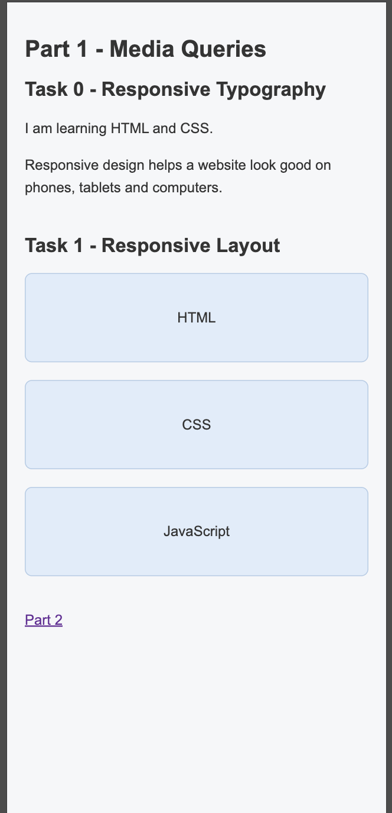
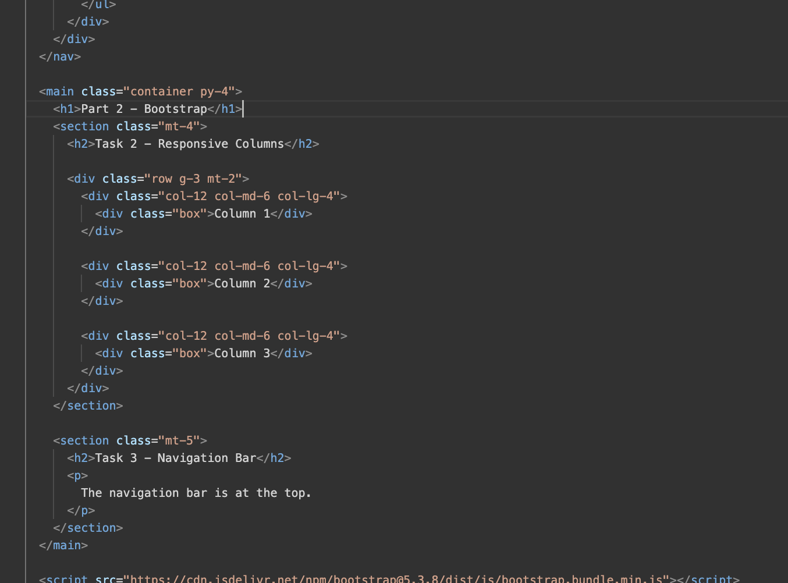
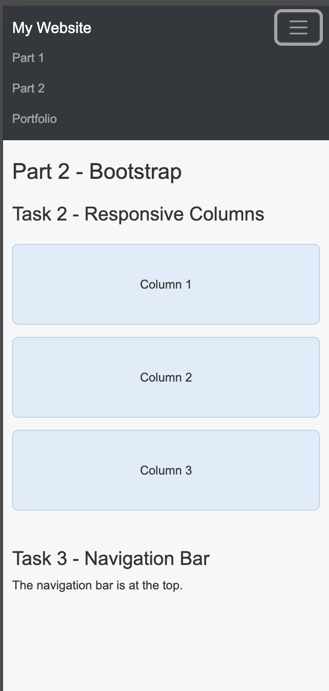
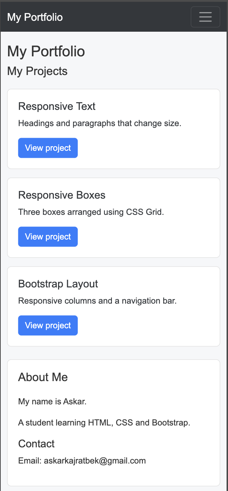

# assignmnet3
## Name: Askar Kairaatbek
## Group: it-2501

About the project
So in his project includes three pages. I used HTML, CSS media queries and Bootstrap to create layouts for mobile, tablet and desktop screens.

# Part 1

## task 0

I created headings and paragraphs. Their font sizes change at 768px and 992px using CSS media queries.

### Task 1 - Responsive Layout

I used CSS Grid to arrange three boxes:
 Mobile: one box per row.
 Tablet: two boxes per row.
 Desktop: three boxes per row.
 
This part does not use Bootstrap.

## Part 2 — Bootstrap

### Task 2 — Responsive Columns

I made three columns using Bootstrap. I used `col-12`, `col-md-6`
and `col-lg-4` to change their layout for different screen sizes.

### Task 3 — Navigation Bar

I added a navigation bar with the website name on the left and links on the right. The links open the other pages. On smaller 
screens, a menu button appears.

## Part 3 — Portfolio

### Task 4 — Responsive Portfolio

I made a portfolio page with project cards, an About Me section, contact details and a footer.
I used Bootstrap Grid to place the projects on the left and the sidebar on the right. On smaller screens, the sidebar moves below
the projects.
I also used media queries to change text sizes and spacing. The introduction is hidden on mobile.

## Work Process

I started with the HTML for each page, then added styles in `style.css`. I used CSS Grid in the first part, Bootstrap in the second part, and both in the portfolio.
